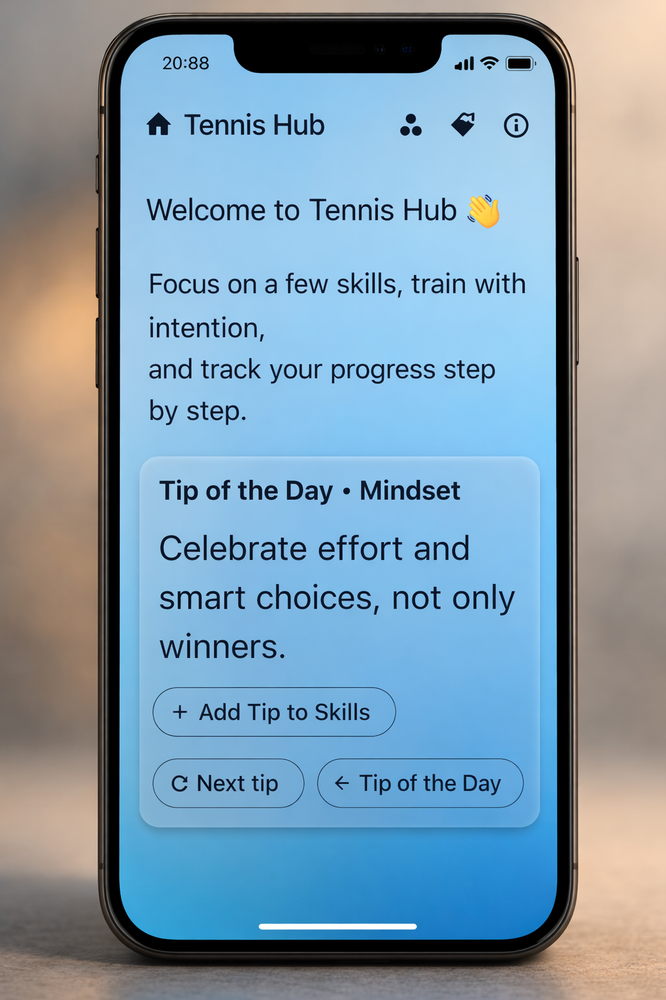
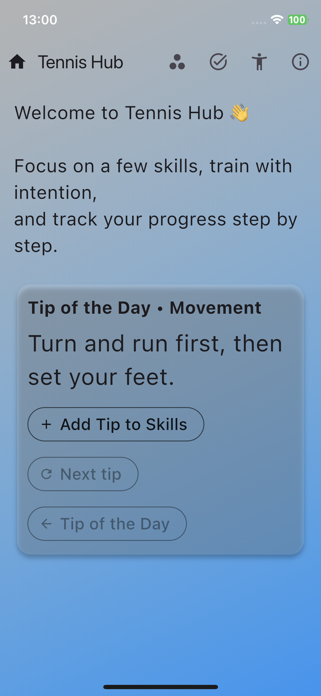
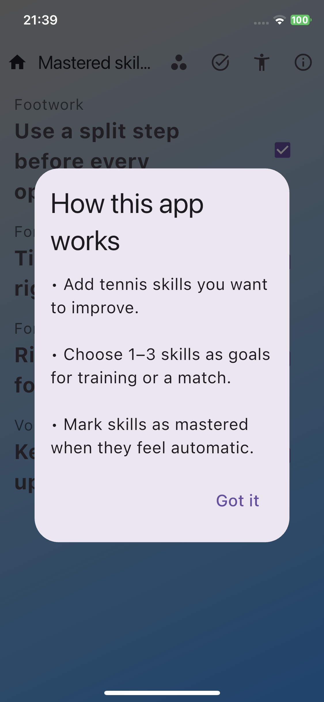
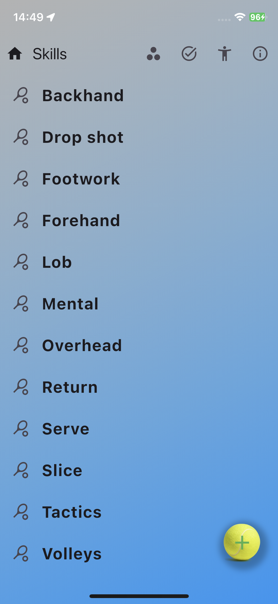
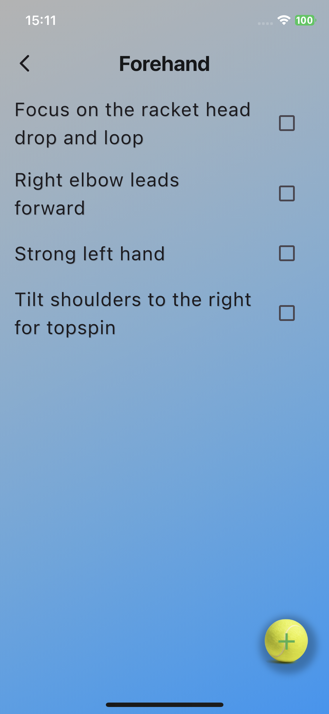
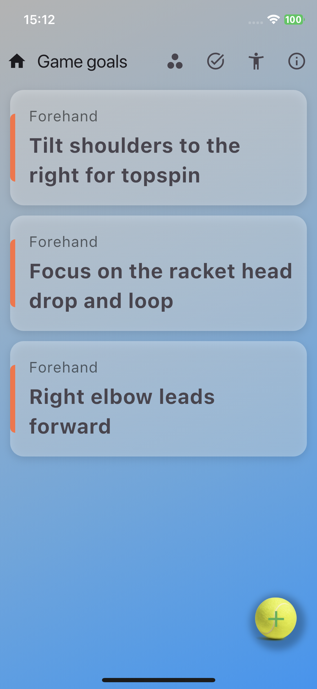
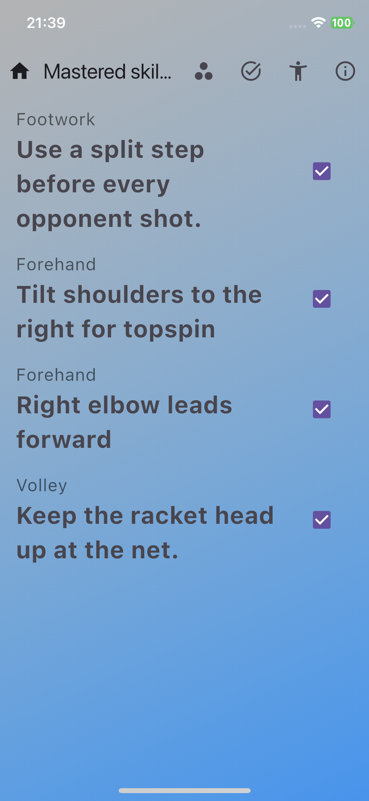

# Tennis Hub 🎾
<p align="center">
  
</p>


Tennis Hub is a Flutter mobile app designed to help tennis players track skill development, manage training goals, and stay motivated with daily improvement tips.

The project demonstrates clean Flutter architecture, cloud-based data storage with Firebase Firestore, and scalable state management using Riverpod.

The app structure and code organization are designed to resemble production-level Flutter applications.

---

## 📱 App Screenshots

<!-- Screenshots -->
### Home & Guidance



### Skills & Areas



### Goals & Progress




---


## 🚀 Key Features

- Skills organized into groups with progress tracking
- Training and match goals management
- "Tip of the Day" to encourage continuous improvement
- Cloud data storage using Firebase Firestore
- Soft deletion system for safe data management

---

## 🧠 Technical Highlights

- Riverpod for predictable and reactive state management
- Firebase Firestore backend
- Controller-based architecture for Firestore data operations
- Feature-based project structure
- Fully null-safe Dart codebase

---

## 🛠 Tech Stack

- Flutter
- Riverpod
- Firebase Firestore
- Material Design UI

---

## 🧩 Architecture Overview

The project follows a **feature-based architecture** where each feature encapsulates its UI, state management, and business logic.

Shared utilities and configuration are placed in the `core` layer.
```text
lib/
├─ core/
│  ├─ config/
│  │  └─ firebase_options.dart
│  ├─ init/
│  │  ├─ seed_skill_areas.dart
│  │  └─ seed_skill_areas_provider.dart
│  ├─ providers/
│  │  └─ app_providers.dart
│  ├─ theme/
│  │  └─ gradient_background.dart
│  └─ widgets/
│     ├─ help_dialog.dart
│     ├─ show_context_menu.dart
│     └─ tennis_ball_button.dart
│
├─ data/
│  └─ default_skill_areas.dart
│
├─ features/
│  ├─ app/
│  │  └─ presentation/
│  │     ├─ models/
│  │     │  └─ screen_data.dart
│  │     ├─ providers/
│  │     │  └─ current_screen_provider.dart
│  │     └─ screens/
│  │        ├─ home_content_screen.dart
│  │        └─ home_page.dart
│  │
│  ├─ goals/
│  │  └─ presentation/
│  │     ├─ providers/
│  │     │  └─ goals_provider.dart
│  │     ├─ screens/
│  │     │  └─ goals_screen.dart
│  │     └─ widgets/
│  │        └─ select_area_skill_dialog.dart
│  │
│  ├─ skills/
│  │  └─ presentation/
│  │     ├─ providers/
│  │     │  ├─ mastered_skills_provider.dart
│  │     │  ├─ skill_areas_map_provider.dart
│  │     │  ├─ skill_areas_provider.dart
│  │     │  ├─ skills_map_provider.dart
│  │     │  └─ skills_provider.dart
│  │     └─ screens/
│  │        ├─ mastered_skills_screen.dart
│  │        ├─ skill_areas_screen.dart
│  │        └─ skills_screen.dart
│  │
│  └─ tips/
│     ├─ data/
│     │  └─ random_tennis_tips.dart
│     └─ providers/
│        └─ tips_provider.dart
│
└─ main.dart